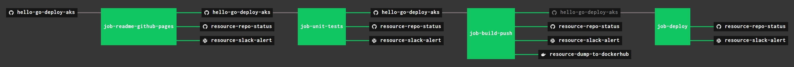

## TEST, BUILT, PUSH & DEPLOY USING CONCOURSE (OPTIONAL)

For fun, I use concourse to automate the above steps.

A pipeline file [pipeline.yml](https://github.com/JeffDeCola/hello-go-deploy-aks/tree/master/ci/pipeline.yml)
shows the entire ci flow. Visually, it looks like,

The `jobs` and `tasks` are,

* `job-readme-github-pages` runs task
  [readme-github-pages.sh](https://github.com/JeffDeCola/hello-go-deploy-aks/tree/master/ci/scripts/readme-github-pages.sh).
* `job-unit-tests` runs task
  [unit-tests.sh](https://github.com/JeffDeCola/hello-go-deploy-aks/tree/master/ci/scripts/unit-tests.sh).
* `job-build-push` runs task
  [build-push.sh](https://github.com/JeffDeCola/hello-go-deploy-aks/tree/master/ci/scripts/build-push.sh).
* `job-deploy` runs task
  [deploy.sh](https://github.com/JeffDeCola/hello-go-deploy-aks/tree/master/ci/scripts/deploy.sh).

The concourse `resources type` are,

* `hello-go-deploy-aks` uses a resource type
  [docker-image](https://hub.docker.com/r/concourse/git-resource/)
  to PULL a repo from github.
* `resource-dump-to-dockerhub` uses a resource type
  [docker-image](https://hub.docker.com/r/concourse/docker-image-resource/)
  to PUSH a docker image to dockerhub.
* `resource-marathon` users a resource type
  [docker-image](https://hub.docker.com/r/ckaznocha/marathon-resource)
  to DEPLOY the newly created docker image to marathon.
* `resource-slack-alert` uses a resource type
  [docker image](https://hub.docker.com/r/cfcommunity/slack-notification-resource)
  that will notify slack on your progress.
* `resource-repo-status` uses a resource type
  [docker image](https://hub.docker.com/r/dpb587/github-status-resource)
  that will update your git status for that particular commit.

For more information on using concourse for continuous integration,
refer to my cheat sheet on [concourse](https://github.com/JeffDeCola/my-cheat-sheets/tree/master/software/operations-tools/continuous-integration-continuous-deployment/concourse-cheat-sheet).
